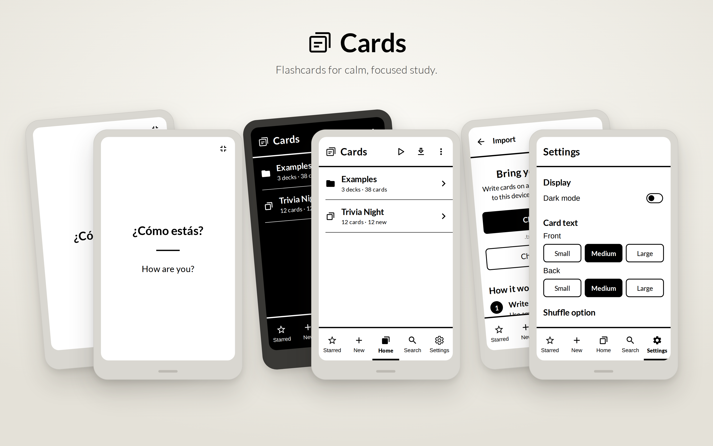

# Cards

**Flashcards for calm, focused study, made for e-ink devices.**



I've been needing a good flashcard app for all of my e-ink devices, and I couldn't find one, so I made one myself. Cards is simple, quiet, and easy on an e-ink screen. There are no animations, no clutter, and no distractions, just your cards.

It was designed for the Mudita Kompakt, and it works on other Android e-ink phones, tablets, and readers too.

---

## Private and secure. Nothing leaves the app.

Cards is **completely offline**. I wouldn't have felt comfortable making this app without these protections, and that's why it works this way:

- **No internet access at all.** Cards doesn't have Android's internet permission, so the system won't let it connect to anything. You can check for yourself: it isn't in [`AndroidManifest.xml`](app/src/main/AndroidManifest.xml).
- **No accounts, no sign-ins, no ads, no analytics, no trackers.** There's no server for Cards to talk to, and no third-party services inside it.
- **Your cards stay on your device.** They're kept in the app's own private storage, which other apps can't read.
- **No automatic cloud backup.** Android's app backup and device-to-device transfer are switched off for Cards, so your data isn't copied anywhere behind your back.
- **You decide when anything leaves.** The only way cards leave the app is when you choose **Export all cards** and pick where to save the file.
- **Open source.** All of the code is here, so anyone can read exactly what the app does.

---

## What it does

- **Folders and decks.** Nest folders as deep as you like, and sort them A–Z or in your own order.
- **Study and Practice.**
  - **Study** shows cards when they're due and spaces out your reviews (using the FSRS algorithm), so you remember them for longer.
  - **Practice** goes through any cards, at any time, without changing your schedule. That makes it good for cramming or a quick review.
- **Full-screen studying.** Only the card is on screen. Tap the middle to see the answer, the right side for the next card, and the left side for the previous one.
- **Choose which cards.** Pick all of them, or any mix of due, new, and starred cards.
- **Stars, search, and shuffle.**
- **Write cards right on your device,** or write them on a computer and import them.
- **Dark mode** that swaps black and white.
- **Easy on e-ink:** high contrast, generous spacing, large touch targets, and Mudita's e-ink design components.
- **Examples included:** a Getting Started deck, World Capitals, Spanish Basics, and a Jeopardy-style Trivia Night deck.

---

## Install

1. Open the [**Releases**](../../releases) page and download **Cards.apk** from the latest release.
2. Open the file on your device. If Android asks, allow installing apps from that source.
3. Open **Cards**. A short welcome explains the basics.

> **Mudita Kompakt:** turn on USB file transfer in the Kompakt's Settings, copy the APK to the phone over USB, then open it on the phone to install.

---

## Getting your cards in

1. **Write your cards** in any plain-text app, or save a spreadsheet as `.csv`.
2. **Copy the files to your device,** over USB or by downloading them.
3. In Cards, open **Import** and tap **Choose files** (`.txt`, `.csv`, or `.zip`) or **Choose a folder**.

Each file becomes a deck, and folders become folders. If you import a file again after editing it, the deck is updated and your progress is kept.

### How to write cards

**One line per card.** Put `::` between the front and the back:

```
Photosynthesis :: Turning light into food
Mitosis :: Cell division
```

**Longer cards.** Start the front with `Q:` and the back with `A:`, and leave a blank line between cards:

```
Q: What are the three
branches of government?
A: Legislative, executive,
and judicial.
```

**From a spreadsheet.** Save it as `.csv`. Column A is the front and column B is the back:

```
Front,Back
gato,cat
perro,dog
```

**Folders.** Folders on your computer become folders in Cards. Lines that start with `#` are ignored, so you can use them as headings.

---

## Transparency

I made Cards with the help of **Claude Code**, Anthropic's AI coding assistant. I designed the app, decided how it should look and work, and tested it on my own devices. Claude Code helped me write the code.

---

## Building it yourself

The app is written in Kotlin with Jetpack Compose. Every push to this repository is built automatically by GitHub Actions; see the **Actions** tab. To build locally, open the project in Android Studio and run it, or run `./gradlew assembleDebug`.

## Credits

- [Mudita Mindful Design](https://github.com/mudita/MMD) for the e-ink components and the Lato typeface. Cards is an independent project and isn't affiliated with or endorsed by Mudita.
- The [FSRS](https://github.com/open-spaced-repetition) spaced-repetition algorithm.
